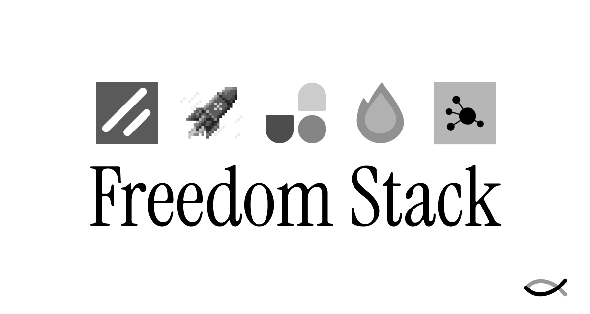

# Freedom Stack v3

A no-build, un-bloated stack built upon Web Standards that feels freeing to use and can be deployed anywhere.



> [!IMPORTANT]
> This README is a work in progress and will improve over time.

## Uses

- [Bun](https://bun.sh) - Mostly used for the package manager, but we can use it for the runtime
- [Hono + Hono JSX](https://hono.dev) - Fast, lightweight, built on Web Standards. Support for any JavaScript runtime.
- [Datastar](https://data-star.dev/) - Hypermedia backend and front-end framework (takes the best of HTMX and Alpine.js)
- [Basecoat](https://basecoatui.com/) - Shadcn UI-like component CSS library without the need for React
- [UnoCSS](https://unocss.dev/) - Runtime-build alternative to TailwindCSS
- [Bknd](https://bknd.io) - Comprehensive backend SDK with auth, db, and Admin UI

## AI Coding Agent Ready

Freedom Stack v3 should work well with AI agents, enabling you to vibe code. Comes with an AGENTS.md file and includes grep.app and Context7 MCP servers for those who use OpenCode. 

Got questions about Freedom Stack v3? [![zread](https://img.shields.io/badge/Ask_Zread-_.svg?style=flat-square&color=00b0aa&labelColor=000000&logo=data%3Aimage%2Fsvg%2Bxml%3Bbase64%2CPHN2ZyB3aWR0aD0iMTYiIGhlaWdodD0iMTYiIHZpZXdCb3g9IjAgMCAxNiAxNiIgZmlsbD0ibm9uZSIgeG1sbnM9Imh0dHA6Ly93d3cudzMub3JnLzIwMDAvc3ZnIj4KPHBhdGggZD0iTTQuOTYxNTYgMS42MDAxSDIuMjQxNTZDMS44ODgxIDEuNjAwMSAxLjYwMTU2IDEuODg2NjQgMS42MDE1NiAyLjI0MDFWNC45NjAxQzEuNjAxNTYgNS4zMTM1NiAxLjg4ODEgNS42MDAxIDIuMjQxNTYgNS42MDAxSDQuOTYxNTZDNS4zMTUwMiA1LjYwMDEgNS42MDE1NiA1LjMxMzU2IDUuNjAxNTYgNC45NjAxVjIuMjQwMUM1LjYwMTU2IDEuODg2NjQgNS4zMTUwMiAxLjYwMDEgNC45NjE1NiAxLjYwMDFaIiBmaWxsPSIjZmZmIi8%2BCjxwYXRoIGQ9Ik00Ljk2MTU2IDEwLjM5OTlIMi4yNDE1NkMxLjg4ODEgMTAuMzk5OSAxLjYwMTU2IDEwLjY4NjQgMS42MDE1NiAxMS4wMzk5VjEzLjc1OTlDMS42MDE1NiAxNC4xMTM0IDEuODg4MSAxNC4zOTk5IDIuMjQxNTYgMTQuMzk5OUg0Ljk2MTU2QzUuMzE1MDIgMTQuMzk5OSA1LjYwMTU2IDE0LjExMzQgNS42MDE1NiAxMy43NTk5VjExLjAzOTlDNS42MDE1NiAxMC42ODY0IDUuMzE1MDIgMTAuMzk5OSA0Ljk2MTU2IDEwLjM5OTlaIiBmaWxsPSIjZmZmIi8%2BCjxwYXRoIGQ9Ik0xMy43NTg0IDEuNjAwMUgxMS4wMzg0QzEwLjY4NSAxLjYwMDEgMTAuMzk4NCAxLjg4NjY0IDEwLjM5ODQgMi4yNDAxVjQuOTYwMUMxMC4zOTg0IDUuMzEzNTYgMTAuNjg1IDUuNjAwMSAxMS4wMzg0IDUuNjAwMUgxMy43NTg0QzE0LjExMTkgNS42MDAxIDE0LjM5ODQgNS4zMTM1NiAxNC4zOTg0IDQuOTYwMVYyLjI0MDFDMTQuMzk4NCAxLjg4NjY0IDE0LjExMTkgMS42MDAxIDEzLjc1ODQgMS42MDAxWiIgZmlsbD0iI2ZmZiIvPgo8cGF0aCBkPSJNNCAxMkwxMiA0TDQgMTJaIiBmaWxsPSIjZmZmIi8%2BCjxwYXRoIGQ9Ik00IDEyTDEyIDQiIHN0cm9rZT0iI2ZmZiIgc3Ryb2tlLXdpZHRoPSIxLjUiIHN0cm9rZS1saW5lY2FwPSJyb3VuZCIvPgo8L3N2Zz4K&logoColor=ffffff)](https://zread.ai/cameronapak/freedom-stack-v3)

## How To

Click the "use this template" button on GitHub or... [use this template](https://github.com/new?template_name=freedom-stack-v3)

Then, clone the repo to your local machine.

Next, install dependencies:

```bash
bun install
```

To run:

```bash
bun run dev
```

## Resources

### Philosophy

- [The The Grug Brained Developer](https://grugbrain.dev/), a layman's guide to thinking like the self-aware smol brained
- [What is HATEOAS?](https://htmx.org/essays/hateoas/)

### Specific

- [Connect your favorite Postgres or SQLite db to Bknd](https://docs.bknd.io/usage/database/)
- [Learn about the different modes of Bknd](https://docs.bknd.io/usage/introduction/#modes)
- [Learn about the Bknd config](https://docs.bknd.io/extending/config/)
- [How to host Hono with Netlify](https://hono.dev/docs/getting-started/netlify) or [Vercel](https://hono.dev/docs/getting-started/vercel) or [Cloudflare Workers](https://hono.dev/docs/getting-started/cloudflare-workers)

### Dig Deeper with Zread

Learn about and ask Zread's AI about...

- [Bknd](https://zread.ai/bknd-io/bknd)
- [Datastar](https://zread.ai/starfederation/datastar)
- [Hono](https://zread.ai/honojs/hono)
- [Basecoat](https://zread.ai/hunvreus/basecoat)
- [UnoCSS](https://zread.ai/unocss/unocss)

> [!NOTE]
> If you find Zread responds in Chinese, you may have to tell it to respond in English. 

Extend your AI coding agent's understanding of these packages by using the [Zread MCP Server](https://docs.z.ai/devpack/mcp/zread-mcp-server)

### Courses

- Lock In Code on YouTube has a fun, free [Datastar Series](https://www.youtube.com/watch?v=I8QLWWPGT-c&list=PLbqyjFEQew904tnpc7dtc6VuyX7HikBfR&index=1)

## Why a new version?

Let's take a stroll down memory lane.

I built the first version of [Freedom Stack](https://github.com/cameronapak/freedom-stack) while learning full-stack web dev. I wanted to help others who were hungry to create have the tools to make their dream a reality.

Freedom Stack v1: Astro, Astro DB, HTMX, Alpine.js, Better Auth, DaisyUI + TailwindCSS. I used it for a bunch of web apps, including the homescreen of the [Wisephone II](https://wisephone.com/). 

It's wild to see the postive reception people have had for Freedom Stack.

Over time, I'd learned in the field. AI coding improved dramatically. I saw what made Freedom Stack great and where it fell short. So I built [Freedom Stack v2](https://github.com/cameronapak/freedom-stack-v2).

v2 was built upon Astro, Alpine.js + Alpine AJAX, TailwindCSS v4 + Basecoat UI, and Bknd.

The truth is I only built one app with v2 (a skateboard deck designer). It remains a work in progress. Honestly, I think v2 was really about exploring [Bknd](https://bknd.io/), which gives you db, auth, storage, plugins, and workflows in a single package.

I'm a huge believer in Bknd because it fulfills what I wanted from day one:

> "A stack that's powerful like Ruby on Rails ('The One Person Framework'), but with the ease and 'vanilla' web dev feel of Astro."

So... why v3, another version?

One word: bloat.

For the past couple years, I've loved working with [Val.Town](https://val.town). Think CodePen but instantly deployed, no devops headaches. Val.Town taught me to love the Hono web framework and the no-build lifestyle.

I was using Alpine.js in Astro with client-side bundling to do too much on the client. Codebases bloated quickly. Late in 2025, because of bloat and slowness, I converted a Freedom Stack app to React + Tanstack Router, going full SPA. _(aside: Anything Tanstack makes using React actually enjoyable.)_ 

Alpine.js and HTMX are different libraries. You have to glue them together. When I found Datastar through [this talk by Delaney Gillilan](https://www.youtube.com/watch?v=0K71AyAF6E4), it became the solution to my Alpine.js and HTMX woes.

I began to realize some widely adopted full-stack frameworks like Laravel and Rails had a far clearer separation between backend and front-end because they were each written in different languages. When JS/TS makes up the front-end and the backend, then things seem to get messy faster, in my opinion. 

[The Tao of Datastar](https://data-star.dev/guide/the_tao_of_datastar) states that: _"Most state should live in the backend. Since the frontend is exposed to the user, the backend should be the source of truth for your application state."_ That's what's known as HATEOAS (Hypermedia as the Engine of Application State). And after years of building, I believe it.

So v3 is no-build, no-bundle. It forces me to keep state on the backend where it belongs. It works with Val.Town. It works anywhere, because it's built on Web Standards.

Freedom Stack v3 is simpler. Lighter. Deployable anywhere.

And that feels freeing.

Welcome to Freedom Stack v3!

— from [Cameron Pak](https://cameronpak.com)
